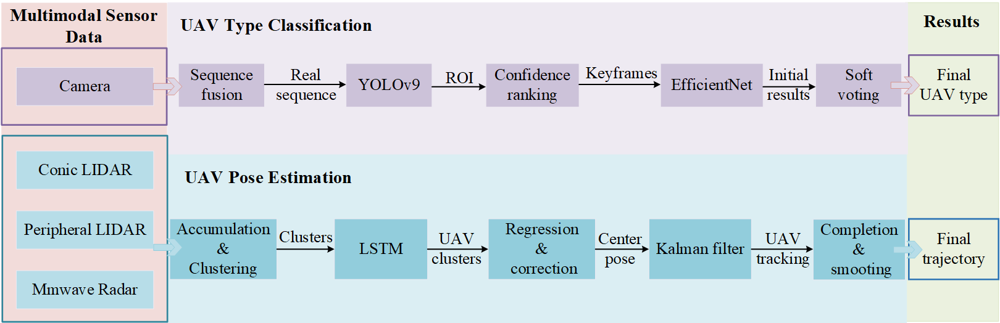

<!-- PROJECT LOGO -->

<p align="center">

  <h1 align="center">Multi-Modal UAV Detection, Classification, and Tracking Algorithm</h1>
  <h3 align="center">CVPR 2024 UG2 Challenge Champion</h3>
  <h3 align="center"><a href="https://arxiv.org/pdf/2405.16464">Paper</a> </h3>
  <div align="center"></div>
</p>

<p align="center">
  <a href="">
    
  </a>
</p>

<br>
<!-- TABLE OF CONTENTS -->
<details open="open" style='padding: 10px; border-radius:5px 30px 30px 5px; border-style: solid; border-width: 1px;'>
  <summary>Table of Contents</summary>
  <ol>
    <li>
      <a href="#installation">Installation</a>
    </li>
    <li>
      <a href="#demo">Online Demo</a>
    </li>
    <li>
      <a href="#usage">Usage</a>
    </li>
    <li>
      <a href="#downloads">Downloads</a>
    </li>
    <li>
      <a href="#benchmarking">Benchmarking</a>
    </li>
    <li>
      <a href="#acknowledgement">Acknowledgement</a>
    </li>
    <li>
      <a href="#citation">Citation</a>
    </li>
  </ol>
</details>
## Installation

##### (Recommended)
Our method has been tested on python 3.10, CUDA>=11.6. The simplest way to install all dependences is to use [anaconda](https://www.anaconda.com/) and [pip](https://pypi.org/project/pip/) in the following steps: 

```bash
conda create -n MMUAV python=3.10
conda activate MMUAV
conda install -c "nvidia/label/cuda-11.6.0" cuda-toolkit
conda install pytorch==1.12.1 torchvision==0.13.1 torchaudio==0.12.1 cudatoolkit=11.6 -c pytorch -c conda-forge
pip install -r requirements.txt
```

<!-- Alternatively, we also provide a conda environment.yml file :
```bash
conda env create -f environment.yml
conda activate MMUAV
``` -->
``` -->
